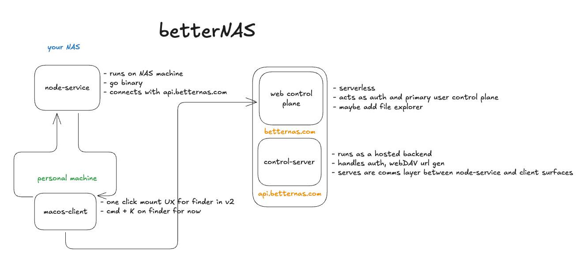

# BetterNAS

<video controls src="/harivansh-afk/betterNAS/media/branch/main/docs/assets/betternas-finder-preview.mp4"></video>

betterNAS lets you mount remote machines as native Finder volumes on your Mac.
Install a small agent on any box with files you care about, and it shows up in Finder like a local drive.
No sync clients, no special apps - just your files, where you expect them.

The plan is bigger: phone, laptop, agents, all seeing the same filesystem.
A modular backup layer you actually use day-to-day, and a way to run agents on your own hardware without handing over the keys.

